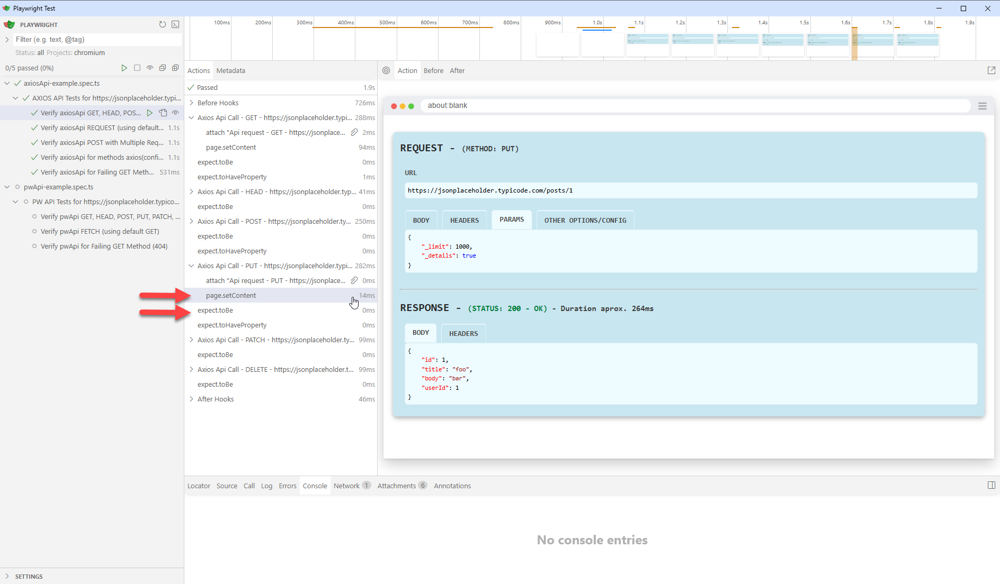
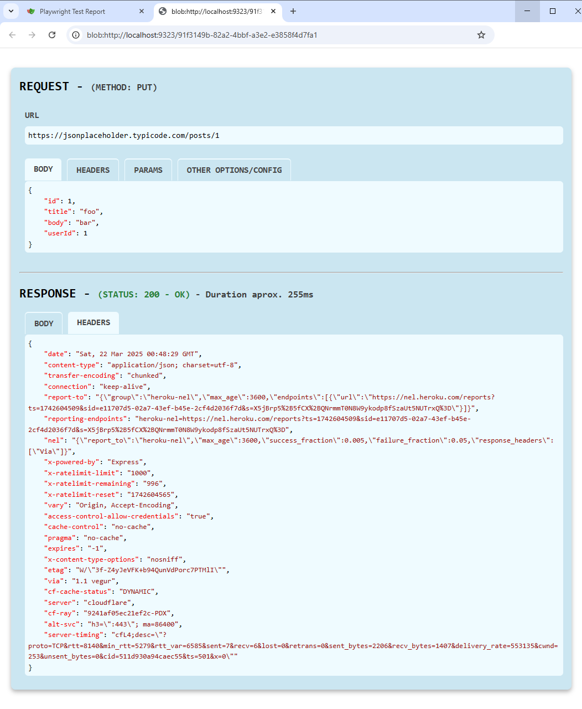

# pw-api-plugin

Playwright plugin for comprehensive API testing and presenting results in a user-friendly manner in the Playwright UI and HTML Report. Supports Playwright native API and Axios requests.


## MAIN FEATURES
- Lightweight library for Playwright test framework supporting Playwright native API and Axios:

  - Playwright native API - Class **`pwApi`**
  
    Methods: `fetch`, `get`, `post`, `put`, `pPatch`, `delete`, and `head`. 

  - Axios API - Class **`axiosApi`** _(Introduced in v2.0.0)_
  
    Methods : `axios`, `request`, `get`, `post`, `put`, `pPatch`, `delete`, `head`, `options`, `postForm`, `putForm`, and `patchForm`.

- These functions can display detailed API request and response information in the  **Playwright UI** and the **Trace Viewer**.

- Each API request and response also can be be included as an attachment in the **HTML Report**. _(Introduced in v1.2.0)_

- The request and response data is presented in tabs to enhance clarity:
  - Request tabs: **`Body`**, **`Headers`**, **`Params`**, **`HTTP Basic Auth`** (axios), **`Proxy`** (axios), **`Functions`** (axios), **`Other Options/Config`**.
  - Response tabs: **`Body`**, **`Headers`**.

- Environment variables **`LOG_API_UI`** and **`LOG_API_UI`** to enable the display of API call details in **Playwright UI** and **HTML Report** respectively. _(Introduced in v2.0.0)_

- Supports multiple API calls within a single test, allowing testing multiple endpoints as part of the same test scenario.


## INSTALLATION

```sh
npm install -D pw-api-plugin
```


## CONFIGURATION

### For Playwright Native API

Add the following line to your test file:

```js
import { pwApi, test } from 'pw-api-plugin';
```

### Axios API

Include the following line to your test file:

```js
import { pwAxios, test } from 'pw-api-plugin';
```


## API REFERENCE

### Playwright Native API

#### ✔️ `pwApi.fetch({ request[, page] }, urlOrRequest[, options])`

Fetches data from the API and logs the request and response data on the Playwright UI.

- **Parameters**:
  - `params` (Object)
    - `request` (APIRequestContext): The API Playwright request context.
    - `page` (Page): Optional the Playwright page object.
  - `urlOrRequest` (string | Request): The URL or request object to fetch.
  - `options` (optional): Optional fetch options.
- **Returns**: `Promise<APIResponse>` - A promise that resolves to the API response.

#### ✔️ `pwApi.get({ request[, page] }, url[, options])`

Makes a GET request to the specified URL and logs the request and response data on the Playwright UI.

- **Parameters**:
  - `params` (Object)
    - `request` (APIRequestContext): The API Playwright request context.
    - `page` (Page): Optional the Playwright page object.
  - `url` (string): The URL to send the GET request to.
  - `options` (optional): Optional settings for the request.
- **Returns**: `Promise<APIResponse>` - A promise that resolves to the API response.

#### ✔️ `pwApi.delete({ request[, page] }, url[, options])`

Makes a DELETE request to the specified URL and logs the request and response data on the Playwright UI.

- **Parameters**:
  - `params` (Object)
    - `request` (APIRequestContext): The API Playwright request context.
    - `page` (Page): Optional the Playwright page object.
  - `url` (string): The URL to send the DELETE request to.
  - `options` (optional): Optional settings for the request.
- **Returns**: `Promise<APIResponse>` - A promise that resolves to the API response.

#### ✔️ `pwApi.head({ request[, page] }, url[, options])`

Makes a HEAD request to the specified URL and logs the request and response data on the Playwright UI.

- **Parameters**:
  - `params` (Object)
    - `request` (APIRequestContext): The API Playwright request context.
    - `page` (Page): Optional the Playwright page object.
  - `url` (string): The URL to send the HEAD request to.
  - `options` (optional): Optional settings for the request.
- **Returns**: `Promise<APIResponse>` - A promise that resolves to the API response.

#### ✔️ `pwApi.post({ request[, page] }, url[, options])`

Makes a POST request to the specified URL and logs the request and response data on the Playwright UI.

- **Parameters**:
  - `params` (Object)
    - `request` (APIRequestContext): The API Playwright request context.
    - `page` (Page): Optional the Playwright page object.
  - `url` (string): The URL to send the POST request to.
  - `options` (optional): Optional settings for the request.
- **Returns**: `Promise<APIResponse>` - A promise that resolves to the API response.

#### ✔️ `pwApi.put({ request[, page] }, url[, options])`

Makes a PUT request to the specified URL and logs the request and response data on the Playwright UI.

- **Parameters**:
  - `params` (Object)
    - `request` (APIRequestContext): The API Playwright request context.
    - `page` (Page): Optional the Playwright page object.
  - `url` (string): The URL to send the PUT request to.
  - `options` (optional): Optional settings for the request.
- **Returns**: `Promise<APIResponse>` - A promise that resolves to the API response.

#### ✔️ `pwApi.patch({ request[, page] }, url[, options])`

Makes a PATCH request to the specified URL and logs the request and response data on the Playwright UI.

- **Parameters**:
  - `params` (Object)
    - `request` (APIRequestContext): The API Playwright request context.
    - `page` (Page): Optional the Playwright page object.
  - `url` (string): The URL to send the PATCH request to.
  - `options` (optional): Optional settings for the request.
- **Returns**: `Promise<APIResponse>` - A promise that resolves to the API response.

---

### Axios API

#### ✔️ `axiosApi.axios({ [page] }, config)` and `axiosApi.axios({ [page] }, url[, config])`

Makes an Axios API call and logs the request and response details.

- **Parameters**:
  - `params` (Object)
    - `page` (Page): Optional the Playwright page object.
  - `arg1` (string | any): The `url` of the API call or a `config` object containing the Axios request configuration.
  - `arg2` (any): Optional the Axios request configuration if `arg1` is a string.
- **Returns**: `Promise<AxiosResponse>` - A promise that resolves to the Axios response.


#### ✔️ `axiosApi.request({ [page] }, config)`

Makes an Axios API request and logs the request and response data on the Playwright UI.

- **Parameters**:
  - `params` (Object)
    - `page` (Page): Optional the Playwright page object.
  - `config` (any): The Axios request configuration object.
- **Returns**: `Promise<AxiosResponse>` - A promise that resolves to the Axios response.


#### ✔️ `axiosApi.get({ [page] }, url[, config])`

Makes an Axios GET request to the specified URL and logs the request and response data on the Playwright UI.

- **Parameters**:
  - `params` (Object)
    - `page` (Page): Optional the Playwright page object.
  - `url` (string): The URL to send the GET request to.
  - `config` (any): Optional the Axios request configuration.
- **Returns**: `Promise<AxiosResponse>` - The response from the Axios GET request.


#### ✔️ `axiosApi.delete({ [page] }, url[, config])`

Makes an Axios DELETE request and logs the request and response data on the Playwright UI.

- **Parameters**:
  - `params` (Object)
    - `page` (Page): Optional the Playwright page object.
  - `url` (string): The URL to send the DELETE request to.
  - `config` (any): Optional the Axios request configuration.
- **Returns**: `Promise<AxiosResponse>` - A promise that resolves to the Axios response.


#### ✔️ `axiosApi.head({ [page] }, url[, config])`

Makes an Axios HEAD request to the specified URL and logs the request and response data on the Playwright UI.

- **Parameters**:
  - `params` (Object)
    - `page` (Page): Optional the Playwright page object.
  - `url` (string): The URL to send the HEAD request to.
  - `config` (any): Optional the Axios request configuration.
- **Returns**: `Promise<AxiosResponse>` - A promise that resolves to the Axios response.


#### ✔️ `axiosApi.options({ [page] }, url[, config])`

Makes an Axios OPTIONS request to the specified URL and logs the request and response data on the Playwright UI.

- **Parameters**:
  - `params` (Object)
    - `page` (Page): Optional the Playwright page object.
  - `url` (string): The URL to which the request is made.
  - `config` (any): Optional the Axios request configuration.
- **Returns**: `Promise<AxiosResponse>` - A promise that resolves to the Axios response.


#### ✔️ `axiosApi.post({ [page] }, url[, data[, config]])`

Makes an Axios POST request and logs the request and response data on the Playwright UI.

- **Parameters**:
  - `params` (Object)
    - `page` (Page): Optional the Playwright page object.
  - `url` (string): The URL to send the POST request to.
  - `data` (any): Optional the data to send in the POST request body.
  - `config` (any): Optional the Axios request configuration.
- **Returns**: `Promise<AxiosResponse>` - A promise that resolves to the Axios response.


#### ✔️ `axiosApi.put({ [page] }, url[, data[, config]])`

Makes an Axios PUT request and logs the request and response data on the Playwright UI.

- **Parameters**:
  - `params` (Object)
    - `page` (Page): Optional the Playwright page object.
  - `url` (string): The URL to send the PUT request to.
  - `data` (any): Optional the data to send in the PUT request body.
  - `config` (any): Optional the Axios request configuration.
- **Returns**: `Promise<AxiosResponse>` - A promise that resolves to the Axios response.


#### ✔️ `axiosApi.patch({ [page] }, url[, data[, config]])`

Makes an Axios PATCH request and logs the request and response data on the Playwright UI.

- **Parameters**:
  - `params` (Object)
    - `page` (Page): Optional the Playwright page object.
  - `url` (string): The URL to send the PATCH request to.
  - `data` (any): Optional the data to send in the PATCH request body.
  - `config` (any): Optional the Axios request configuration.
- **Returns**: `Promise<AxiosResponse>` - A promise that resolves to the Axios response.


#### ✔️ `axiosApi.postForm({ [page] }, url[, data[, config]])`

Makes an Axios POST request with 'FormData' and logs the request and response data on the Playwright UI.

- **Parameters**:
  - `params` (Object)
    - `page` (Page): Optional the Playwright page object.
  - `url` (string): The URL to send the POST request to.
  - `data` (any): Optional the `FormData` instance to send as the form body.
  - `config` (any): Optional the Axios request configuration.
- **Returns**: `Promise<AxiosResponse>` - The Axios response object.

#### ✔️ `axiosApi.putForm({ [page] }, url[, data[, config]])`

Makes an Axios PUT request with 'FormData' and logs the request and response data on the Playwright UI.

- **Parameters**:
  - `params` (Object)
    - `page` (Page): Optional the Playwright page object.
  - `url` (string): The URL to send the PUT request to.
  - `data` (any): Optional the `FormData` instance to send with the request.
  - `config` (any): Optional the Axios request configuration.
- **Returns**: `Promise<AxiosResponse>` - A promise that resolves to the Axios response.


#### ✔️ `axiosApi.patchForm({ [page] }, url[, data[, config]])`

Makes an Axios PATCH request with 'FormData' and logs the request and response data on the Playwright UI.

- **Parameters**:
  - `params` (Object)
    - `page` (Page): The Playwright page object.
  - `url` (string): The URL to send the PATCH request to.
  - `data` (any): Optional the `FormData` instance to send with the request.
  - `config` (any): Optional the Axios request configuration.
- **Returns**: `Promise<AxiosResponse>` - The Axios response object.


## USAGE

### Environment variables

The plugin provides two environment variables to control when the details of the API calls are presented to the user:

- When the environment variable **`LOG_API_UI`** is set to **`"true"`**, the API request and response information is presented in the Playwright UI in a user-friendly format. By default, the results are not displayed in the **Playwright UI**.

- If the environment variable **`LOG_API_REPORT`** is set to **`"true"`**, the details of the API request and response are included as attachments in the **HTML Report**. By default, the results are not included in the Playwright HTML Report.

#### Setting Environment Variables in the Terminal
Environment variables can be configured directly in the terminal before running the tests. For example:

In Playwright, environment variables can be set in the terminal before running the tests:

E.g. in PowerShell

```shell
$env:LOG_API_UI="true"
$env:LOG_API_REPORT="true"
npx playwright test
```

#### Environment Variables Using a `.env` File

Another way to set environment variables in Playwright is by using a `.env` file in combination with the `dotenv` package. This approach is useful for managing multiple variables and maintaining consistency across different environments.

**Steps**:

1. **Install the `dotenv` package**:

   Use the following command to install `dotenv`:
   ```shell
   npm install dotenv
   ```
2. **Create a `.env` file**:

   Add your environment variables to a `.env` file in the root directory of your project. For example:
   ```json
   LOG_API_UI=true
   LOG_API_REPORT=true
   ```
3. **Load the `.env` file in your Playwright configuration**:

   Update your `playwright.config.ts` or `playwright.config.js` file to load the `.env` file using the `dotenv` package:
   ```js
   require('dotenv').config();

   const config = {
       // Your Playwright configuration settings
   };

   module.exports = config;
   ```
  By following these steps, the environment variables specified in the .env file will automatically be available in all your Playwright tests.


> For more information, read the official documentation on [Passing Environment Variables](https://playwright.dev/docs/test-parameterize#passing-environment-variables "Passing Environment Variables").


### Extension of the `test` function


The library also introduces an extension of the **`test`** function, ensuring that the `page` fixture provided in the test **is only considered** when users want to display API call details in the UI by setting the environment variable `LOG_API_UI` to `"true"`. Otherwise, the `page` fixture will be ignored, improving performance.

Users can still utilize the standard Playwright `test` function from `@playwright/test`. However, including the `page` fixture in the test may lead to reduced performance, even if the environment variable `LOG_API_UI` is set to `"true"`. Therefore, it is recommended to use the `test` function provided by the `pw-api-plugin`.

To use this, simply include the following in your tests:

```js
import { test } from 'pw-api-plugin';
```
 

### Playwright Native API

This plugin introduces a new class **`pwApi`**, that supports all Playwright native request methods: `fetch`, `get`, `post`, `put`, `patch`, `delete`, and `head` (that are part of the `APIRequestContext` class). These methods allow your tests to display the API request and response information in a user-friendly format in both the **Playwright UI** and the **HTML Report**.


To utilize these functions, include the following import statement at the top of your test file:

```js
import { pwApi } from 'pw-api-plugin';
```

Since these methods will use Playwright's `request` fixture and can also display the request and response information in the **Playwright UI**, they require an object containing the `request` and `page` fixtures as the first parameter. The remaining parameters are the same as in the original Playwright request.


For example, if an API call using Playwright's standard `get` is:

```js
const responseGet = await request.get(`${baseUrl}/posts/1`);
```

Then, using the new `pwApi.ge` function, the call will be:

```js
const responseGet = await pwApi.get({ request, page }, `${baseUrl}/posts/1`);
```

👉👉👉 **IMPORTANT:** If you do not want to present the API details in the **Playwright UI**, you can omit the `page` and simply pass the `request` fixture. This approach will make the call more efficient:

```js
const responseGet = await pwApi.get({ request }, `\${baseUrl}/posts/1`);
```


#### Examples

```js
// tests/pwApi-example.spec.ts
import { expect } from '@playwright/test';

import { pwApi, test } from 'pw-api-plugin';


test.describe('PW API Tests for https://jsonplaceholder.typicode.com', () => {

    const baseUrl = 'https://jsonplaceholder.typicode.com';

    test('Verify pwApi GET, HEAD, POST, PUT, PATCH, DELETE in single test', async ({ request, page }) => {

        // ✔️ Example of get
        const responseGet = await pwApi.get({ request, page }, `${baseUrl}/posts/1`)
        expect(responseGet.status()).toBe(200)
        const responseBodyGet = await responseGet.json()
        expect(responseBodyGet).toHaveProperty('id', 1)


        // ✔️ Example of head
        const responseHead = await pwApi.head({ request, page }, `${baseUrl}/posts/1`)
        expect(responseHead.status()).toBe(200)


        // ✔️ Example of post (with request body and request headers)
        const responsePost = await pwApi.post({ request, page }, `${baseUrl}/posts`, 
            {
                data: {
                    title: 'foo',
                    body: 'bar',
                    userId: 1,
                },
                headers: {
                    'Content-type': 'application/json; charset=UTF-8',
                },
            }
        );
        expect(responsePost.status()).toBe(201)
        const responseBodyPost = await responsePost.json()
        expect(responseBodyPost).toHaveProperty('id', 101)


        // ✔️ Example of put (with request: body, headers, params, timeout, maxRetries)
        const responsePut = await pwApi.put({ request, page }, 'https://jsonplaceholder.typicode.com/posts/1', 
            {
                data: {
                    id: 1,
                    title: 'foo',
                    body: 'bar',
                    userId: 1,
                },
                headers: {
                    'Content-type': 'application/json; charset=UTF-8',
                },
                params: { _limit: 1000, _details: true },
                timeout: 2000,
                maxRetries: 1
            }
        )
        expect(responsePut.ok()).toBeTruthy()
        const responseBodyPut = await responsePut.json()
        expect(responseBodyPut).toHaveProperty('id', 1)


        // ✔️ Example of patch (with request body and request headers)
        const responsePatch = await pwApi.patch({ request, page }, 'https://jsonplaceholder.typicode.com/posts/1',
            {
                data: {
                    title: 'hello',
                },
                headers: {
                    'Content-type': 'application/json; charset=UTF-8',
                },
            }
        );
        expect(responsePatch.ok()).toBeTruthy()


        // ✔️ Example for delete
        const responseDelete = await pwApi.delete({ request, page }, 'https://jsonplaceholder.typicode.com/posts/1');
        expect(responseDelete.ok()).toBeTruthy()

    })


    test('Verify pwApi FETCH (using default GET)', async ({ request, page }) => {

        // ✔️ Example fetch (default GET)
        const responseFetch = await pwApi.fetch({ request, page }, `${baseUrl}/posts`);
        expect(responseFetch.status()).toBe(200)
        const responseBodyFetch = await responseFetch.json()
        expect(responseBodyFetch.length).toBeGreaterThan(4)
        
    })

    
    test('Verify pwApi for Failing GET Method (404)', async ({ request, page }) => {

        // ❌ Example for get with wrong URL
        const responseFetch = await pwApi.get({ request, page }, `${baseUrl}/this-is-a-non-sense-endpoint`)
        expect(responseFetch.status()).toBe(404)
        
    })
})
```

---

### Axios API

This library also introduces a new class, **`axiosApi`**, supporting all Axios library request methods: `request`, `get`, `post`, `put`, `patch`, `delete`, `head`, `options`, `postForm`, `putForm`, and `patchForm` within the `AxiosStatic` class. These methods can display API request and response information in the **Playwright UI** and the **HTML Report** as attachments.


To utilize these functions, include the following import statement at the top of your test file:

```js
import { pwAxios } from 'pw-api-plugin';
```

Since these methods can display the request and response information in the **Playwright UI**, they require an object containing the `page` fixture as the first parameter. The remaining parameters are the same as in the original Axios request.

For example, if an API call using Axios's standard `get` is:

```js
const responseGet = await axios.get(`${baseUrl}/posts/1`);
```

Then, using the new `apiGet` function, the call will be:

```js
const responseGet = await axiosApi.get({ page }, `${baseUrl}/posts/1`);
```

👉👉👉 **IMPORTANT:** If you prefer not to present the API details in the **Playwright UI**, you can omit the page and instead pass an empty object as the first argument. This approach will make the call more efficient:

```js
const responseGet = await axiosApi.get({}, `${baseUrl}/posts/1`);
```


#### Examples

```js
// tests/pwAxios-example.spec.ts

import { expect } from '@playwright/test';

import { axiosApi, test } from 'pw-api-plugin;


test.describe('AXIOS API Tests for https://jsonplaceholder.typicode.com', () => {

    const baseUrl = 'https://jsonplaceholder.typicode.com';

    test('Verify axiosApi GET, HEAD, POST, PUT, PATCH, DELETE in single test', async ({ page }) => {

        // ✔️ Example of get
        const responseGet = await axiosApi.get({ page }, `${baseUrl}/posts/1`)
        expect(responseGet.status).toBe(200)
        const responseBodyGet = await responseGet.data
        expect(responseBodyGet).toHaveProperty('id', 1)


        // ✔️ Example of head
        const responseHead = await axiosApi.head({ page }, `${baseUrl}/posts/1`)
        expect(responseHead.status).toBe(200)


        // ✔️ Example of post (with request: body, headers, params)
        const responsePost = await axiosApi.post({ page }, `${baseUrl}/posts`,
            {
                title: 'foo',
                body: 'bar',
                userId: 1,
            },
            {
                headers: {
                    'Content-type': 'application/json; charset=UTF-8',
                },
            }
        )
        expect(responsePost.status).toBe(201)
        const responseBodyPost = await responsePost.data
        expect(responseBodyPost).toHaveProperty('id', 101)


        // ✔️ Example of put (with request body and request headers)
        const responsePut = await axiosApi.put({ page }, 'https://jsonplaceholder.typicode.com/posts/1',
            {
                id: 1,
                title: 'foo',
                body: 'bar',
                userId: 1,
            },
            {
                headers: {
                    'Content-type': 'application/json; charset=UTF-8',
                },
                params: { _limit: 1000, _details: true },
                timeout: 2000,
                maxRetries: 1
            }
        )
        expect(responsePut.status).toBe(200)
        const responseBodyPut = await responsePut.data
        expect(responseBodyPut).toHaveProperty('id', 1)


        // ✔️ Example of patch (with request body and request headers)
        const responsePatch = await axiosApi.patch({ page }, 'https://jsonplaceholder.typicode.com/posts/1',
            {
                title: 'hello',
            },
            {
                headers: {
                    'Content-type': 'application/json; charset=UTF-8',
                },
            }
        )
        expect(responsePatch.status).toBe(200)


        // ✔️ Example for delete
        const responseDelete = await axiosApi.delete({ page }, 'https://jsonplaceholder.typicode.com/posts/1')
        expect(responsePatch.status).toBe(200)

    })


    test('Verify axiosApi REQUEST (using default GET)', async ({ page }) => {

        // ✔️ Example fetch (default GET)
        const responseRequest = await axiosApi.request({ page }, { url: `${baseUrl}/posts`, params: { _limit: 20000, _details: true }})
        expect(responseRequest.status).toBe(200)
        const responseBodyRequest = await responseRequest.data
        expect(responseBodyRequest.length).toBeGreaterThan(4)

    })


    test('Verify axiosApi POST with Multiple Request Tabs', async ({ page }) => {

        // ✔️ Example of post (with request: body, headers, params, timeout, maxRetries)
        const responsePost = await axiosApi.post({ page }, `${baseUrl}/posts`,
            {
                id: 1,
                title: 'foo',
                body: 'bar',
                userId: 1,
            },
            {
                headers: {
                    'Content-type': 'application/json; charset=UTF-8',
                },
                params: { _limit: 1000, _details: true },
                timeout: 2000,
                maxRetries: 1,
                responseType: 'json',
                auth: {
                    username: 'john.wick',
                    password: 'babayaga'
                },
            }
        )
        expect(responsePost.status).toBe(201)
        const responseBodyPost = await responsePost.data
        expect(responseBodyPost).toHaveProperty('id', 101)

    })


    test('Verify axiosApi for methods axios(config) and axios(url, config)', async ({ page }) => {

        // ✔️ Example of axios(config)
        const responseAxios1 = await axiosApi.axios({ page }, { url: `${baseUrl}/posts/1`, params: { _details: true },
            validateStatus: (status: number) => status === 200
        })
        expect(responseAxios1.status).toBe(200)
        const responseBodyAxios1 = await responseAxios1.data
        expect(responseBodyAxios1).toHaveProperty('id', 1)

        // ✔️ Example of axios(url, config)
        const responseAxios2 = await axiosApi.axios({ page }, `${baseUrl}/posts/1`, { params: { _getid: true }})
        expect(responseAxios2.status).toBe(200)
        const responseBodyAxios2 = await responseAxios2.data
        expect(responseBodyAxios2).toHaveProperty('id', 1)

    })


    test('Verify axiosApi for Failing GET Method (404)', async ({ page }) => {

        // ❌ Example for get with wrong URL
        const responseFetch = await axiosApi.get({ page }, `${baseUrl}/this-is-a-non-sense-endpoint`,
            { validateStatus: (status: number) => status === 404 }
        )
        expect(responseFetch.status).toBe(404)

    })
})
```

## PRESENTATION OF RESULTS

### In Playwright User Interface

To display detailed information about the API calls (request and response) in a user-friendly format in the **Playwright UI**, you need to ensure the following:

1. Pass the **`page`** fixture to the pw-api-plugin methods in the object provided as the first argument.
2. Set the environment variable **`LOG_API_UI`** to **`"true"`**.

To view detailed information about a specific API call, click on the **Actions** panel in the **page.setContent** line or in the assertion located immediately after the API call.



_Overview and details of API requests and responses presented in the Playwright UI._

If you are using Axios methods, the card displaying the details of the API call can include additional tabs if such is provided in the `config` argument, such as **HTTP Basic Auth**, *Proxy* settings, and transformation **Functions**.


_Overview and detailed information about API requests in Axios, including additional tabs._


### In Playwright HTML Report

To include detailed information about the API calls (request and response) in a user-friendly format in the **HTML Report**, you need to ensure the following:
1. Set the environment variable `LOG_API_REPORT` to `"true"`.


_Overview and details of API requests and responses presented in the HTML Report._

By clicking on one of the API attachments, you can display the API call details directly in the browser and interact with the tabs.



_Details of an API request, along with its response, are included as an attachment in the HTML Report._

The API results can also be visualized in the Trace Viewer by adding the option `--trace=on` when running the tests:

```shell
npx playwright test --trace=on
```


## LICENSE

This project is licensed under the MIT License. See the [LICENSE](LICENSE) file for more details.


## CONTRIBUTING

First off, thanks for taking the time to contribute!

**Special thank you to [Mohammad Monfared](https://www.linkedin.com/in/monfared/ "Mohammad Monfared") for his amazing contribution to this plugin. Man you rock!!! 🤟**

To contribute, please follow the best practices promoted by GitHub on the [Contributing to a project](https://docs.github.com/en/get-started/exploring-projects-on-github/contributing-to-a-project "Contributing to a project") page.

And if you like the project but just don't have the time to contribute, that's fine. There are other easy ways to support the project and show your appreciation, which we would also be very happy about:
- Star the project
- Promote it on social media
- Refer this project in your project's readme
- Mention the project at local meetups and tell your friends/colleagues
- Buying me a coffee or contributing to a training session, so I can keep learning and sharing cool stuff with all of you.

<a href="https://www.buymeacoffee.com/sclavijosuero" target="_blank"></a>

Thank you for your support!


## COLABORATORS

- **https://github.com/mmonfared (Mohammad Monfared)**


## CHANGELOG

### [2.0.0]
- Support for Playwright native requests via the `pwApi` class (⚠️ Breaking Change).
- Support for Axios requests via the `axiosApi` class.
- Support for new request configuration tabs, including:
  - `Params` and `Other Options/Config` (for both Playwright native and Axios requests).
  - `HTTP Basic Auth`, `Proxy`, and `Functions` (specific to Axios requests only).
- New environment variables:
  - `LOG_API_UI`: Enables or disables the display of API call details in the Playwright UI (disabled by default).
  - `LOG_API_REPORT`: Enables or disables the inclusion of API call details as attachments in reports (disabled by default).
- Included in the response the Approximate Duration and Status Text.
- Improved default behavior: The content in the Request and Response tabs is collapsed by default to reduce visual clutter.
- Enhanced API inspection: View detailed information about individual APIs by clicking a specific request in the Actions panel. (Previously, details for the entire list of API calls were shown at the end of a test.)
- Performance improvements.
- Deep reengineering of the core source code for better efficiency and maintainability.

### [1.2.0]
- API requests and results included in HTML report as attachment.
- Group all the actions of the plugin API call within a `test.step()`

### [1.1.2]
- Fixed typo in documentation and examples.

### [1.1.1]
- Fixed issue with request body not showing in the tab.

### [1.1.0]
- Added information about response headers.
- Support for tabs in the response and request body/headers to enhance data clarity.
- Fix for an issue where the response does not return a body.

### [1.0.2]
- Full support for Typescript  (contribution by [Mohammad Monfared](https://github.com/w4dd325 "Mohammad Monfared")).
  
### [1.0.1]
- Fix depedencies with Playwright.

### [1.0.0]
- Initial release.
